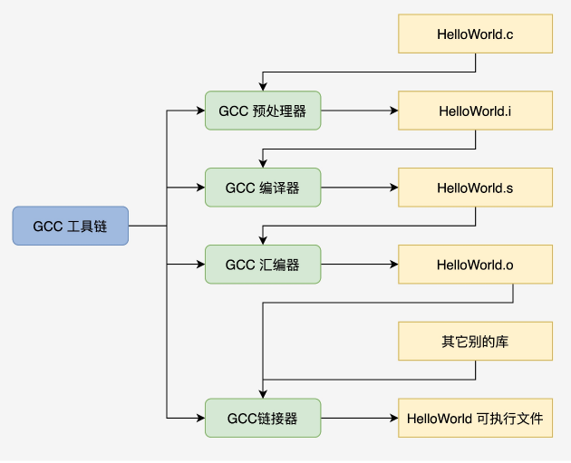
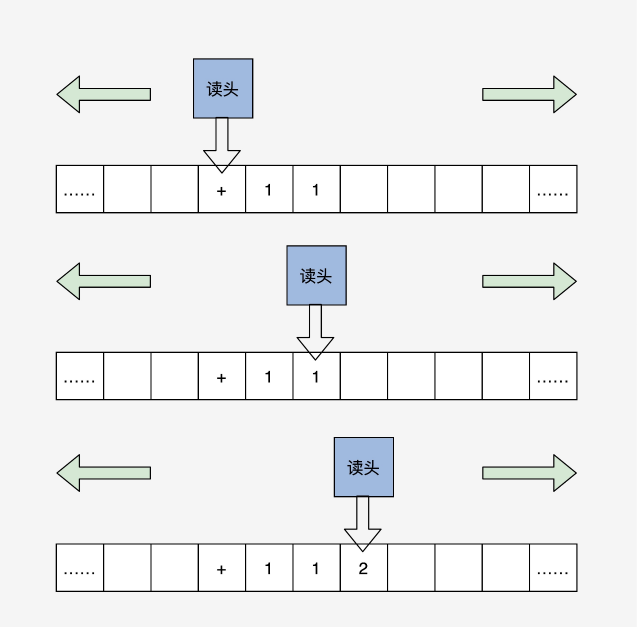
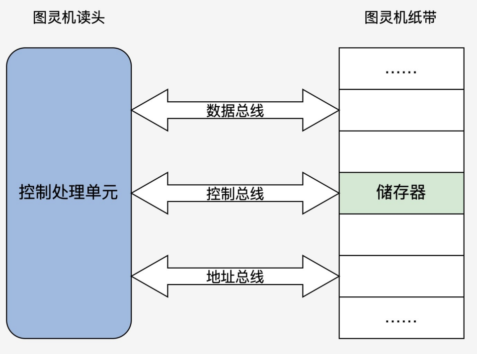

# 程序编译过程  

  

gcc HelloWorld.c -E -o HelloWorld.i预处理：加⼊头⽂件，替换宏。  
gcc HelloWorld.c -s -c HelloWorld.s编译：包含预处理，将C程序转换成汇编程序。  
gcc HelloWorld.c -c HelloWorld.o汇编：包含预处理和编译，将汇编程序转换成可链接的⼆进制程序。  
gcc HelloWorld.c -o HelloWorld链接：包含以上所有操作，将可链接的⼆进制程序和其它别的库链接在起，形成可执⾏的程序⽂件。  

# 程序装载执⾏  

图灵机是⼀个抽象的模型，它是这样的：有⼀条⽆限⻓的纸带，纸带上有⽆限个⼩格⼦，⼩格⼦中写有相关的信息，纸带上有⼀个读头，读头能根据纸带⼩格⼦⾥的信息做相关的操作并能来回移动。  

  

冯诺依曼体系结构构成的计算机，必须具有如下功能：  

- 把程序和数据装⼊到计算机中；  
- 必须具有⻓期记住程序、数据的中间结果及最终运算结果；  
- 完成各种算术、逻辑运算和数据传送等数据加⼯处理；  
- 根据需要控制程序⾛向，并能根据指令控制机器的各部件协调操作；  
- 能够按照要求将处理的数据结果显⽰给⽤⼾。  

计算机必须具备五⼤基本组成部件：  

- 装载数据和程序的输⼊设备；  
- 记住程序和数据的存储器；  
- 完成数据加⼯处理的运算器；  
- 控制程序执⾏的控制器；  
- 显⽰处理结果的输出设备。  

  